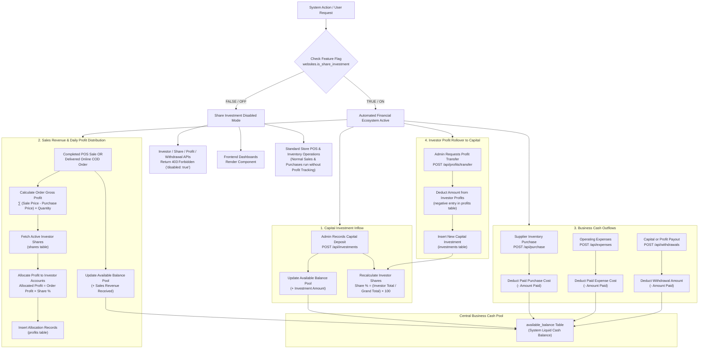

# System Financial Flow & Accounting Architecture

This document provides a comprehensive guide to the total financial flow, mathematical formulas, cash pool rules, investor equity allocations, and feature flag controls in the POS & Inventory Management System.

---

## 1. Executive Summary & Financial Ecosystem

The system operates an automated, integrated financial engine that manages the business cash pool, inventory purchases, operating expenses, daily sales profits, and investor equity shares.

### Key Financial Principles:
1. **Unified Cash Pool (`available_balance`)**: Tracks total liquid cash in the business.
2. **Automated Investor Equity (`shares`)**: Investor share percentages are calculated dynamically based on relative capital investments.
3. **Daily Sales Profit Allocation (`profits`)**: Gross sales profits per item $(\text{sale\_price} - \text{purchase\_price}) \times \text{quantity}$ are automatically allocated to active investors according to their equity share percentages.
4. **Profit-to-Capital Rollover**: Accumulated investor profits can be converted directly into capital investments (increasing equity ownership).
5. **Feature Flag Control (`is_share_investment`)**: Controls whether investor equity, daily profit distribution, and investor balance tracking are active or disabled.

---

## 2. Complete End-to-End System Flowchart



---

## 3. Mathematical Formulas & Accounting Equations

### A. System Available Balance Equation
$$\text{Available Balance} = \sum \text{Investments} + \sum \text{Sales Payments} - \sum \text{Purchase Payments} - \sum \text{Expense Payments} - \sum \text{Withdrawals}$$

| Transaction Type | Effect on `available_balance` | Table Source |
| :--- | :--- | :--- |
| **New Capital Investment** | **+ Add** | `investments` |
| **POS Store Sale** | **+ Add** | `payments` |
| **Online Order Payment / COD** | **+ Add** | `payments` |
| **Supplier Purchase Payment** | **- Deduct** | `purchase_payments` |
| **Operating Expense Payment** | **- Deduct** | `expense_payments` |
| **Investor Capital / Profit Withdrawal** | **- Deduct** | `withdrawals` |

---

### B. Gross Sales Profit Formula
For any completed POS sale or delivered online order:
$$\text{Gross Profit} = \sum_{i=1}^{n} \left( \text{Item Sale Price}_i - \text{Item Purchase Price}_i \right) \times \text{Quantity}_i$$

*Note: Purchase price is retrieved from the corresponding product variant (`product_variants.purchase_price`).*

---

### C. Investor Equity Share Percentage Formula
Equity share percentages are calculated dynamically from investment totals across all active investors:
$$\text{Share Percentage}_i = \left( \frac{\text{Total Investment of Investor } i}{\sum \text{Total Investments of All Investors}} \right) \times 100$$

- **Example**:
  - Investor A Total Investment = ৳60,000
  - Investor B Total Investment = ৳40,000
  - Grand System Investment = ৳100,000
  - **Investor A Share** = $\frac{60,000}{100,000} \times 100 = \mathbf{60\%}$
  - **Investor B Share** = $\frac{40,000}{100,000} \times 100 = \mathbf{40\%}$

---

### D. Daily Profit Distribution to Investors
When a gross sales profit $P$ is calculated:
$$\text{Allocated Profit}_i = P \times \left( \frac{\text{Share Percentage}_i}{100} \right)$$

- **Example**: If gross profit $P = \text{৳1,000}$:
  - Investor A (60%) receives: $\text{৳1,000} \times 0.60 = \mathbf{৳600}$ (Logged in `profits`)
  - Investor B (40%) receives: $\text{৳1,000} \times 0.40 = \mathbf{৳400}$ (Logged in `profits`)

---

## 4. Feature Flag Controls (`is_share_investment`)

The `is_share_investment` column in the `websites` table governs feature availability system-wide:

```
                          is_share_investment
                                  |
               +------------------+------------------+
               |                                     |
           [ FALSE ]                             [ TRUE ]
               |                                     |
  - Investor/Profit APIs return 403    - Full Investor/Share System Active
  - Dashboards show Disabled Card      - Cash Pool Tracking Enabled
  - Profit Calculation Skipped         - Automated Profit Allocations Active
```

### When `is_share_investment` is FALSE:
- **API Guard**: All `/api/investor`, `/api/investments`, `/api/shares`, `/api/profits`, and `/api/withdrawals` routes return `403 Forbidden` (`{ disabled: true }`).
- **Frontend Dashboard**: Visiting `/dashboard/investor`, `/dashboard/investments`, `/dashboard/shares`, `/dashboard/profits`, or `/dashboard/withdrawals` displays a clean `<ShareInvestmentDisabled />` card with a quick link to Enable the feature in `/dashboard/settings`.
- **Sales & Purchases**: Sales and purchase operations continue functioning for normal store operations without updating investor profits.

### When `is_share_investment` is TRUE:
- Full investor ecosystem is active.
- Shares are computed automatically from capital investments.
- Gross sales profits from POS and online orders are distributed daily into investor profit accounts.
- Admin can convert accumulated profits into capital investments (`/api/profits/transfer`).

---

## 5. Detailed Module Workflows

### 1. Investor Management (`/dashboard/investor`)
- Admins register investor profiles (Name, Phone, Email, Address, NID/Passport).
- Displays total invested, total withdrawn, net capital balance, and auto-calculated share percentage.

### 2. Investment Ledger (`/dashboard/investments`)
- Records incoming capital deposits.
- **Cash Flow Action**: Automatically calls `updateAvailableBalance(+amount)` to add cash to the business pool.
- **Share Action**: Calls `recalculateInvestorShares()` to update equity percentages for all active investors.

### 3. Expense Management (`/dashboard/expenses`)
- Admins and Managers log operational expenses (Rent, Utilities, Supplies, Salaries).
- Supports line items (Item Name, Qty, Unit Cost) and initial or partial payment amounts.
- **Cash Flow Action**: Automatically calls `updateAvailableBalance(-paidAmount)` to deduct paid expense amounts from the available balance pool.

### 4. Supplier Purchases (`/dashboard/purchase`)
- Tracks purchase orders from suppliers for product inventory.
- **Cash Flow Action**: Calls `updateAvailableBalance(-amountPaid)` when initial or installment purchase payments are logged.

### 5. Sales & POS Checkout (`/dashboard/sale`)
- In-store POS checkout and delivered storefront orders collect payments.
- **Cash Flow Action**: Calls `updateAvailableBalance(+paymentReceived)`.
- **Profit Action**: Calculates gross profit per item sold $(\text{sale\_price} - \text{purchase\_price}) \times \text{quantity}$ and triggers `allocateOrderProfit(orderId)`.

### 6. Investor Profits & Capital Transfer (`/dashboard/profits`)
- Displays daily profit distribution logs and investor accumulated profit balances.
- **Transfer Action**: **"Transfer Profit to Investment"** modal allows converting accumulated investor profit balances into capital investments (`investments` table), deducting from profit logs and recalculating equity shares.

### 7. Capital & Profit Withdrawals (`/dashboard/withdrawals`)
- Records payouts to investors or staff.
- Supports `withdrawal_type`:
  - `'investment'`: Capital withdrawal from investor principal.
  - `'profit'`: Payout from accumulated investor profits.
- **Cash Flow Action**: Calls `updateAvailableBalance(-withdrawalAmount)`.

---

## 6. Database Table Reference

| Table Name | Primary Role | Key Columns |
| :--- | :--- | :--- |
| `websites` | Website settings & feature flags | `website_id`, `is_share_investment`, `hero_title` |
| `available_balance` | System cash pool balance | `balance_id`, `available_balance`, `updated_at` |
| `investors` | Registered investor accounts | `investor_id`, `name`, `phone`, `email`, `is_active` |
| `investments` | Capital investment ledger | `investment_id`, `investor_id`, `amount`, `payment_method` |
| `shares` | Investor equity percentages | `share_id`, `investor_id`, `share_percentage`, `status` |
| `profits` | Daily investor profit logs | `profit_id`, `investor_id`, `profit_date`, `amount`, `note` |
| `expenses` | Operating expenses header | `expense_id`, `title`, `total_amount`, `paid_amount`, `due_amount` |
| `expense_items` | Expense breakdown line items | `item_id`, `expense_id`, `item_name`, `quantity`, `unit_cost` |
| `expense_payments` | Expense payment installments | `payment_id`, `expense_id`, `amount`, `payment_method` |
| `purchases` | Inventory purchase invoices | `purchase_id`, `supplier_id`, `subtotal_amount`, `total_amount` |
| `purchase_payments` | Inventory purchase payments | `payment_id`, `purchase_id`, `amount_paid`, `payment_method` |
| `orders` | Sales orders (POS & Storefront) | `order_id`, `customer_id`, `subtotal_amount`, `total_amount` |
| `order_items` | Products sold per order | `order_item_id`, `order_id`, `product_id`, `variant_id`, `quantity`, `price` |
| `payments` | Customer sales payments | `payment_id`, `order_id`, `amount`, `payment_status` |
| `withdrawals` | Payouts & capital withdrawals | `withdrawal_id`, `investor_id`, `amount`, `withdrawal_type` |
